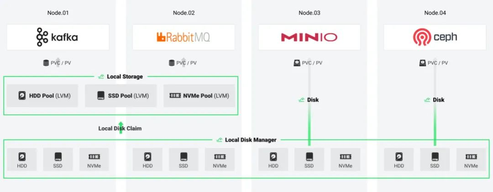

HwameiStor, an automated, highly available, cloud native, local storage system, is coming online

<!--truncate-->

> News today: The local storage system provided by HwameiStor is creating a new land of "metaverse" that belongs to developers and evolves rapidly, waiting for you to join.

Daocloud officially launched the open source project today. HwameiStor creates a local storage resource pool for centrally managing all disks such as HDD, SSD, and NVMe. It uses the CSI architecture to provide distributed services with local volumes, and provides data persistence capabilities for stateful cloud-native workloads or components.

In the cloud native era, application developers can focus on the business logic itself, while the agility, scalability, and reliability required by the application runtime attribute to the infrastructure platform and O&M team. **Hwameistor is a storage system that grows in the cloud native era. **It has the advantages of high availability, automation, cost-efficiency, rapid deployment, and high performance. It can replace the expensive traditional SAN storage.

## The local storage is smart, stable, and agile

- Automatic operation and maintenance management
  
  Automatically discover, identify, manage, and allocate disks. Intelligently schedule applications and data based on affinity. Automatically monitor the disk status and give early warning in time.

- Highly available data
  
  Use inter-node replicas to synchronize data for high availability. When a problem occurs, the application will be automatically scheduled to a highly available data node to guarantee the application continuity.

- Multiple data volume types are supported
  
  Aggregate HDD, SSD, and NVMe disks to provide data service with low latency and high throughput.

- Flexible and dynamic linear expansion
  
  A dynamic expansion is supported according to the cluster size, to flexibly meet the data persistence needs of applications.

## Enrich scenarios and widely adapt to enterprise needs

- Adapt to middlewares with high available architecture
  
  Kafka, Elasticsearch, Redis, and other middleware applications have high available architecture and strict requirements for IO data access. The LVM-based single-replica local data volume provided by HwameiStor can well meet their requirements.

- Provide highly available data volumes for applications
  
  MySQL and other OLTP databases require the underlying storage to provide highly available data storage, which can quickly restore data in case of problems. At the same time, it is also required to guarantee high-performance data access. The dual-replica high available data volume provided by HwameiStor can well meet such requirements.

- Automated operation and maintenance of traditional storage software
  
  MinIO, Ceph, and other storage software need to use the disks on a kubernetes node. These software can utilize PVC/PV to automatically use the single-replica local volume of HwameiStor through CSI drivers, quickly respond to the deployment, expansion, migration, and other requests from the business system, and realize the automatic operation and maintenance based on Kubernetes.

## Join us

If the coming future is an era of intelligent Internet, developers will be the pioneers to that milestone, and the open source community will become the "metaverse" of developers.

If you have any questions about the HwameiStor cloud-native local storage system, welcome to join the community to explore this metaverse world dedicated for developers and grow together.
