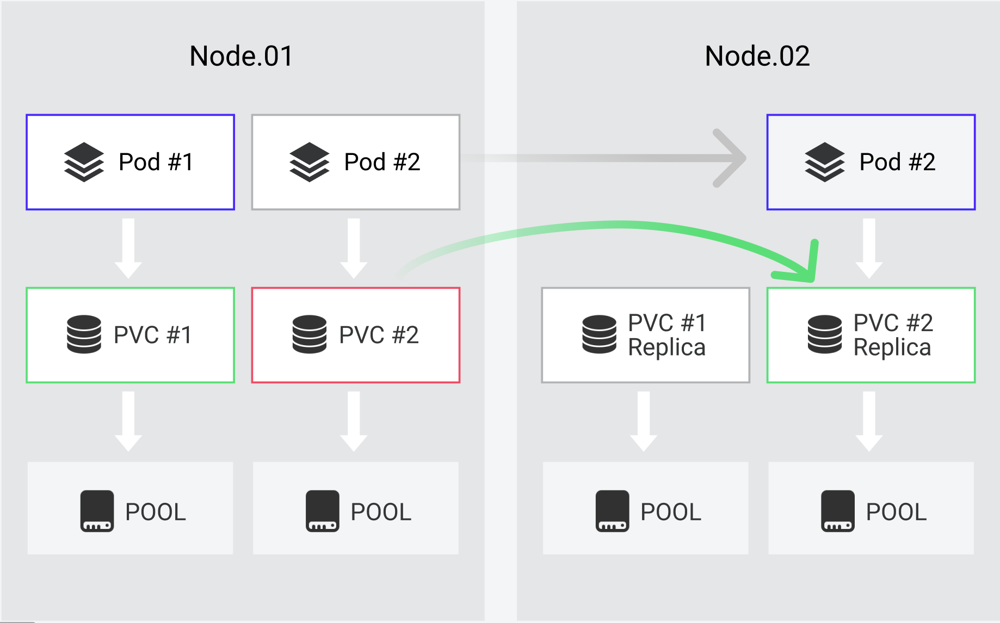

<!--在Kubernetes中，当用户创建一个PVC，并指定使用Hwameistor作为底层存储时，Hwameistor会创建两类CR，即本文的主角`LocalVolume`,`LocalVolumeReplica`. 那为什么Hwameistor会为一个PV创建这两类资源呢？本文将为您揭开谜团。-->
In Kubernetes, when a PVC is created and uses HwameiStor as its local storage, HwameiStor will create two kinds of CR: `LocalVolume` and `LocalVolumeReplica`. Why create these two resources for one PV? Continue to read and you will find the answer.



## LocalVolume

<!--`LocalVolume`：是Hwameistor定义的CRD，代表Hwameistor为用户提供的数据卷，`LocalVolume`和Kubernetes的`PersistentVolume`是一一对应的，含义也是类似的，均代表一个数据卷，不同之处在于`LocalVolume`会记录Hwameistor相关的信息，而`PersistentVolume`会记录Kubernetes平台本身的信息，并关联到`LocalVolume`.-->
`LocalVolume` is a CRD defined by HwameiStor. It is the volume that HwameiStor provides for users. Each `LocalVolume` corresponds to a `PersistentVolume` of Kubernetes. Both are volumes, but `LocalVolume` stores HwameiStor-related information, while the other records information about Kubernetes itself and links it to `LocalVolume`.

<!--可以通过以下命令查看系统中`LocalVolume`的详细信息：-->
You can check details of `LocalVolume` with this command:

```
#  check status of local volume and volume replica
$ kubectl get lv # or localvolume
NAME                                       POOL                   KIND   REPLICAS   CAPACITY     ACCESSIBILITY   STATE      RESOURCE   PUBLISHED   AGE
pvc-996b05e8-80f2-4240-ace4-5f5f250310e2   LocalStorage_PoolHDD   LVM    1          1073741824   k8s-node1       Ready   -1                     22m
```

<!--既然Hwameistor可以通过`LocalVolume`表示一个数据卷，为什么还需要`LocalVolumeReplica`呢？-->
Now that HwameiStor can use `LocalVolume` to provide a volume, why do we still need `LocalVolumeReplica`?

## LocalVolumeReplica

<!--`LocalVolumeReplica`：也是Hwameistor定义的CRD，但是与`LocalVolume`不同，`LocalVolumeReplica`代表数据卷的副本。-->
`LocalVolumeReplica` is another CRD defined by HwameiStor. It represents a replica of a volume.

<!--在Hwameistor中，`LocalVolume`会指定某个属于它的`LocalVolumeReplica`作为当前激活的副本。可以看出`LocalVolume`可以拥有多个`LocalVolumeReplica`，即一个数据卷可以有多个副本。目前Hwameistor会在众多副本中激活其中一个，被应用程序挂载，其他作为热备副本。-->
In HwameiStor, `LocalVolume` can specify one of its `LocalVolumeReplica` as the active replica. As a volume, `LocalVolume` can have many `LocalVolumeReplica` as its replicas. The replica in active state will be mounted by applications and others will stand by as high available replicas.

<!--可以通过以下命令查看系统中`LocalVolumeReplica`的详细信息：-->
You can check details of `LocalVolumeReplica` with this command:

```
$ kubectl get lvr # or localvolumereplica
NAME                                              KIND   CAPACITY     NODE        STATE   SYNCED   DEVICE                                                               AGE
pvc-996b05e8-80f2-4240-ace4-5f5f250310e2-v5scm9   LVM    1073741824   k8s-node1   Ready   true     /dev/LocalStorage_PoolHDD/pvc-996b05e8-80f2-4240-ace4-5f5f250310e2   80s
```

<!--有了卷副本（LocalVolumeReplica）的概念后Hwameistor作为一款本地存储系统，具备了一些很有竞争力的特性，例如数据卷的HA，迁移，热备，Kubernetes应用快速恢复等等。-->
`LocalVolumeReplica` allows HwameiStor to support features like HA, migration, hot standby of volumes and fast recovery of Kubernetes applications, making it more competitive as a local storage tool.

<!--## 总结-->
## Conclusion

<!--其实`LocalVolume`和`LocalVolumeReplica`在很多存储系统中都有引入，是个很通用的概念，只是通过这一概念，实现了各具特色的产品，在解决某个技术难点的时候也可能采取不同的解决方案，因此而适合于不同的生产场景。-->
`LocalVolume` and `LocalVolumeReplica` are common concepts in many storage products, but each product can have its own competitive and unique features based on these two concepts. A technical difficulty can be solved with different solutions, so these concepts are also suitable for different production scenarios.

<!--随着Hwameistor的迭代和演进，我们将会提供更多的能力，从而适配越来越多的使用场景。无论您是用户还是开发者，欢迎您加入Hwameistor的大家庭！-->
We will provide more capabilities for more scenarios in future releases. Both users and developers are welcome to join us!
